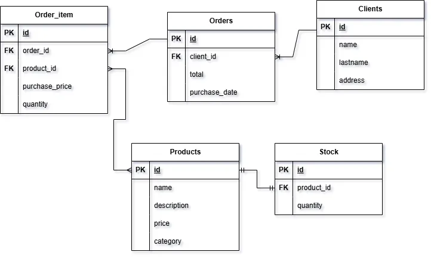

# Sistema de gestion de pedidos + stock + clientes

## Diagrama entidad relacion



### Decisiones:

- Se separaron los pedidos en pedidos y items de pedido, para poder manejar pedidos con multiples productos.
- Item de pedido tiene un atributo de precio de compra para evitar problemas de cambios de precio en el futuro. Almacenando el precio al momento de la compra.
- Stock se separó de la entidad producto para poder manejar el stock de cada producto de manera independiente. Además permite escalabilidad a multiples depositos o sucursales.
- Se agregó una entidad cliente para poder manejar la información de los clientes y sus pedidos.
- Se agregó atributo categoría a la entidad producto para mejorar el filtrado y organización de los productos.

## DDL

```sql

```
